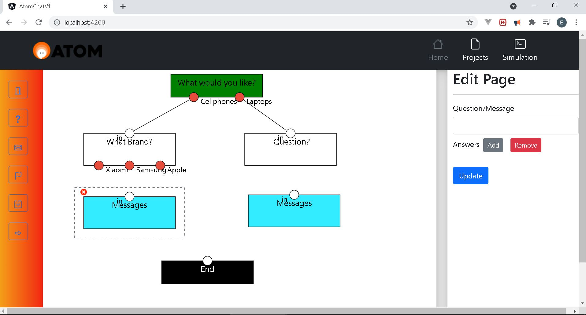

# FrontEnd_Flowbuilder

## Overview

This project serves as a first step to create a flowbuilder to create chatbots. The reason for this it's to make easier the creation of the logic of the chatbot without having to deal directly with google's dialogflow/

## Screenshot of the project

## Status

Unfinished. The are issues with saving states and the inputs and outputs using the jointjs library..

## Key topics

The following topics are covered in the
creation of the project:

- Angular
  - File Structure
  - Services, components
  - GET and POST requests
- Typescript
  - Logic
  - Interfaces
- Bootstrap
  - Form styling
  - Bottons
- JointJS
  - Flow creation.

## Development server

Run `ng serve` for a dev server. Navigate to `http://localhost:4200/`. The app will automatically reload if you change any of the source files.

## Build

Run `ng build` to build the project. The build artifacts will be stored in the `dist/` directory.

## Running unit tests

Run `ng test` to execute the unit tests via [Karma](https://karma-runner.github.io).

## Running end-to-end tests

Run `ng e2e` to execute the end-to-end tests via a platform of your choice. To use this command, you need to first add a package that implements end-to-end testing capabilities.

## Further help

To get more help on the Angular CLI use `ng help` or go check out the [Angular CLI Overview and Command Reference](https://angular.io/cli) page.
